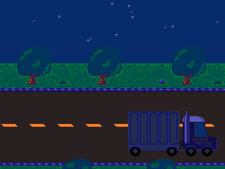

# 🚗

This is my entry for [CC26](https://www.cemetech.net/news/2023/11/1007/_/cemetech-contest-26-screensaver)! The main focus was mostly silliness, and I really just added stuff I found funny. Maybe you'll find it funny too?

# Usage

Simply download the [latest release](https://github.com/TIny-Hacker/road-to-nowhere/releases/latest) and send it to your calculator using TI-Connect CE or another transfer software, then run the program. When you want to exit, press any key. That's all you need to know!

# Features

There's a number of features including:
- Ten vehicles (One of these is a winter-exclusive car). A good number of them are jokes related to Cemetech.
- Animated clouds / stars depending on the time of day.
- Day and night, based on the time set in the calculator's clock. The program will update along with the clock as it progresses through the day, and changes the palette based on the time.
- Snowing during the winter (based on the calculator's date), which can accumulate on the ground. Theoretically, the screen could eventually turn fully white, but since explosions melt the snow and even without melting it would take days, this probably wouldn't occur before the death of the sun.
- Car accidents with explosions and screen shake. Vehicles have a rare chance of speeding up when driving over snow, and this can result in them crashing into other vehicles.
- Probably other stuff I forgot, you can dig through the code or try it yourself to find any other fun easter eggs :)

# Screenshots

(This last one will probably never happen)

# Conclusion

Thanks for checking this out and I hope you enjoy it! Be sure to also look at the [development thread](https://www.cemetech.net/forum/viewtopic.php?t=19353), there's some fun stuff there too! 

Thank you to [calc84maniac](https://github.com/calc84maniac/) and [RoccoLox Programs](https://github.com/roccoloxprograms/) for digging into boot.InitializeHardware with me to figure out a better way to get SPI stuff working on Python models! :)

